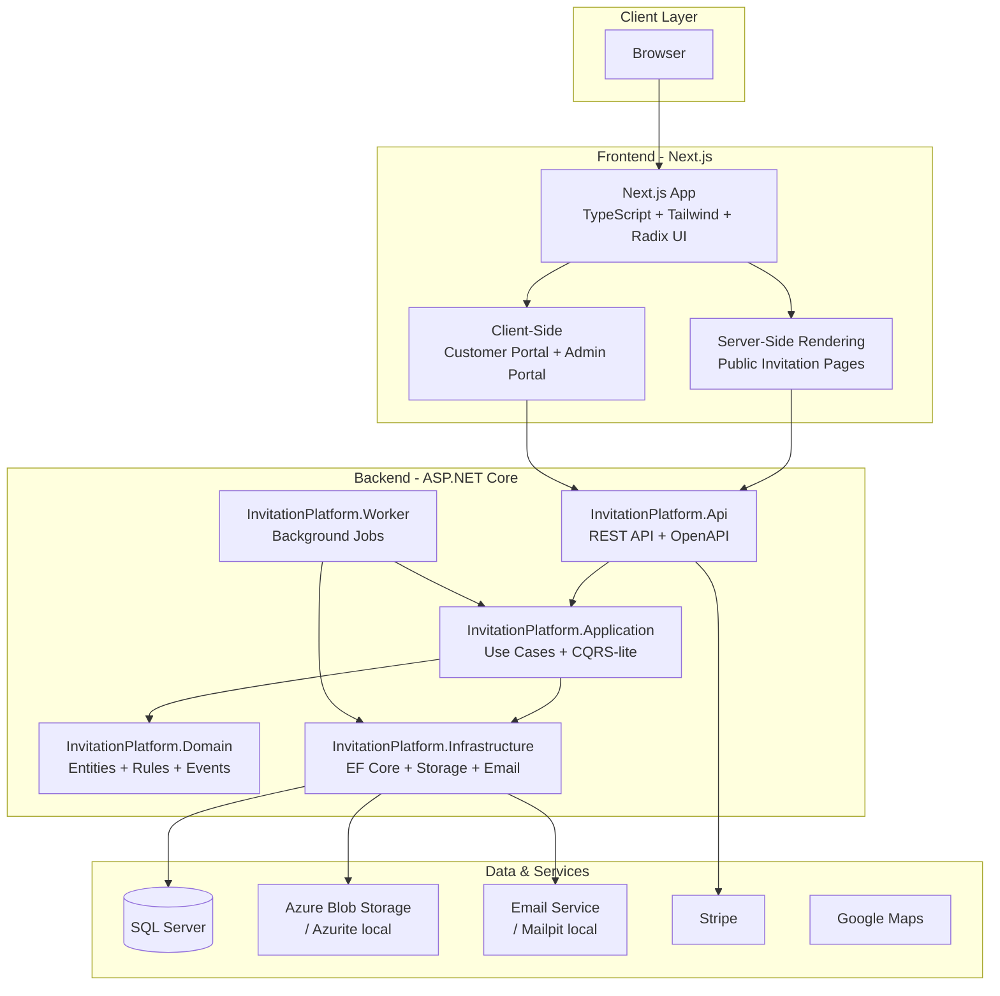
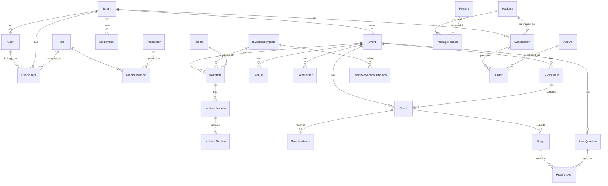
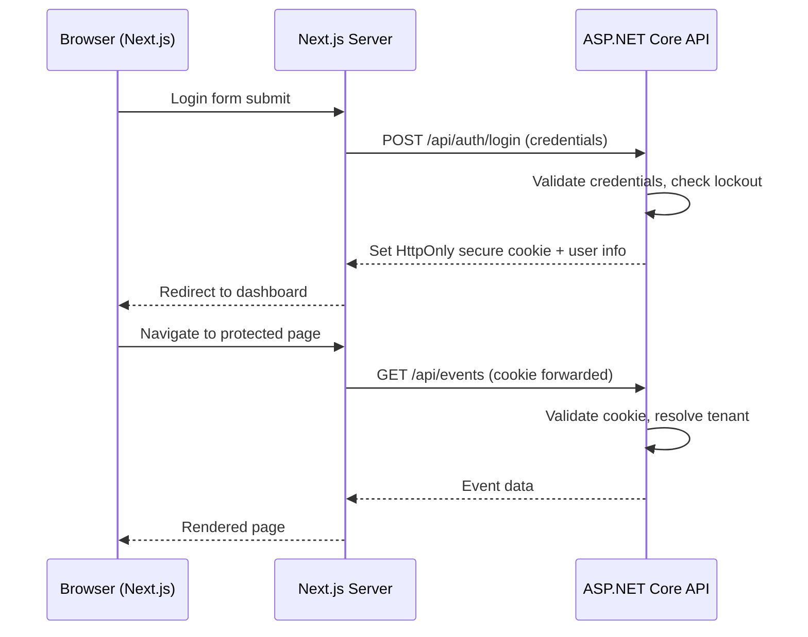

# YIDO Platform - Technical Architecture Plan

**Version:** 1.0
**Date:** 2026-07-25
**Status:** Draft - Pending Review

---

## Table of Contents

1. [Executive Summary](#1-executive-summary)
2. [Product Scope](#2-product-scope)
3. [Functional Requirements](#3-functional-requirements)
4. [Architecture](#4-architecture)
5. [SQL Server Data Model](#5-sql-server-data-model)
6. [Multi-Tenant Security](#6-multi-tenant-security)
7. [Authentication & Authorization](#7-authentication--authorization)
8. [Local Development Environment](#8-local-development-environment)
9. [Environment Strategy](#9-environment-strategy)
10. [Media & File Security](#10-media--file-security)
11. [Background Processing](#11-background-processing)
12. [UI & Design Direction](#12-ui--design-direction)
13. [Invitation Editor Strategy](#13-invitation-editor-strategy)
14. [API Design](#14-api-design)
15. [Security Requirements](#15-security-requirements)
16. [Testing Strategy](#16-testing-strategy)
17. [CI/CD](#17-cicd)
18. [Delivery Phases](#18-delivery-phases)
19. [Final Deliverables](#19-final-deliverables)
20. [Risks & Mitigations](#20-risks--mitigations)

---

## 1. Executive Summary

YIDO (Your Important Day Online) is a multi-tenant SaaS platform for creating and managing digital invitations for weddings, baptisms, parties, corporate events, and similar occasions, targeting the Greek market initially with multilingual expansion capability.

**Architecture:** Next.js frontend (TypeScript, Tailwind CSS, Radix UI) communicating with an ASP.NET Core Web API backend (modular monolith, C#, Entity Framework Core) backed by Microsoft SQL Server. Local development runs entirely in Docker. Production targets Azure.

**Key differentiators:**
- Controlled template editor (not a generic page builder)
- Multi-tenant with tenant-isolated data at every layer
- Greek-first content with full Unicode/Greek typography support
- Three distinct visual experiences: public invitation, customer portal, admin portal
- Production-grade security baseline (OWASP ASVS Level 2)

### Assumptions

1. Single deployment serving all tenants (shared database, tenant-discriminated)
2. MVP targets individual customers (couples, families), not enterprise accounts
3. Payment processing via Stripe (existing integration pattern from current codebase)
4. No real-time collaboration on invitation editing in MVP
5. Video hosting delegated to external provider (not self-hosted streaming)
6. Custom domains are a post-MVP feature
7. Greek and English are the two supported languages at launch
8. Maximum ~10,000 guests per event is a reasonable upper bound
9. The platform operator is a single company (not a white-label reseller platform in MVP)

### Open Questions

| # | Question | Impact | Default Assumption |
|---|----------|--------|--------------------|
| 1 | Will customers self-register or be onboarded by sales? | Registration flow, email verification | Self-registration with email verification |
| 2 | Is Stripe Connect needed for marketplace-style payouts? | Payment architecture | No - direct Stripe charges to platform |
| 3 | Should invitation templates be created by internal designers only or also by customers? | Template system complexity | Internal designers only in MVP |
| 4 | What is the expected concurrent event volume at launch? | Infrastructure sizing | <500 active events |
| 5 | Is SMS notification required for RSVP confirmations? | Third-party integration, cost | Email only in MVP |
| 6 | Should guests be able to upload photos (guest gallery)? | Storage, moderation | Yes, with moderation queue |
| 7 | Are seasonal/holiday templates needed? | Content planning | Post-MVP |
| 8 | What is the data retention policy after event expiry? | Storage costs, GDPR | 12 months after event date, then archive |
| 9 | Is A/B testing of invitation designs needed? | Complexity | No |
| 10 | Will there be a mobile app or is web-only sufficient? | Development scope | Web-only (PWA consideration post-MVP) |

---

## 2. Product Scope

### Business Objective

Build a commercially viable SaaS platform that allows Greek-market customers to create, manage, and share beautiful digital invitations for life events, replacing or complementing traditional printed invitations. Revenue model: tiered package sales with add-on upsells.

### Target Audiences

| Role | Description | Primary Goals |
|------|-------------|---------------|
| **Platform Administrator** | Internal team managing the platform | Customer support, template management, content moderation, business operations |
| **Internal Designer** | Creates and maintains invitation templates | Template design, theme creation, font curation |
| **Customer** | Person organizing an event (couple, parent, company) | Create invitation, manage guests, track RSVPs, publish event page |
| **Guest** | Invitee receiving the digital invitation | View invitation, RSVP, access event details, view map/directions |
| **Account Manager** (future) | Sales/support staff assigned to customers | Customer onboarding, upselling, support |

### Customer Types

- **Individual** - Couple planning a wedding, parent planning a baptism
- **Family** - Multiple family members collaborating on an event
- **Business** - Company organizing a corporate event, product launch, or gala

### Main Use Cases

1. Customer registers, selects a package, and creates an event
2. Customer selects a template and customizes the invitation
3. Customer adds venues with map links
4. Customer imports/adds guests and guest groups
5. Customer previews the invitation on mobile and desktop
6. Customer publishes the invitation page
7. Guests receive invitation links and view the public page
8. Guests submit RSVP responses
9. Customer monitors RSVP statistics and exports data
10. Customer upgrades package or purchases add-ons
11. Administrator manages templates, customers, and platform operations
12. Administrator provides customer support with temporary impersonation

### Commercial Packages

| Feature | Mini (49 EUR) | Digital (99 EUR) | Video (179 EUR) |
|---------|:---:|:---:|:---:|
| Digital invitation page | Yes | Yes | Yes |
| Custom event slug | No | Yes | Yes |
| RSVP form | Basic (attend/decline) | Full (meal, questions, +1) | Full |
| Guest limit | 100 | 300 | 500 |
| Photo gallery | No | Up to 20 photos | Up to 50 photos |
| Video invitation section | No | No | Yes |
| Background audio | No | No | Yes |
| QR code | No | Yes | Yes |
| Gift list / IBAN | No | Yes | Yes |
| Template selection | 3 basic | All templates | All templates + premium |
| Custom colors | No | Yes | Yes |
| Custom fonts | No | Limited | Full catalogue |
| Printable invitation upload | No | Yes | Yes |
| Excel export | No | Yes | Yes |
| Email notifications to guests | No | Up to 100 | Up to 300 |
| Event duration (active) | 3 months | 6 months | 12 months |
| Support | Email | Email + priority | Email + priority + phone |

### Add-Ons

| Add-On | Price | Description |
|--------|-------|-------------|
| Extra 100 guests | 19 EUR | Increase guest limit |
| Extra 20 gallery photos | 9 EUR | Additional photo slots |
| Guest photo uploads | 29 EUR | Allow guests to upload photos |
| Custom domain | 39 EUR | Use your own domain for the invitation |
| Extended duration (+6 months) | 19 EUR | Keep the page active longer |
| Additional email batch (100) | 15 EUR | More email notifications |

---

## 3. Functional Requirements

### 3.1 Customer & Account Management

- **Registration**: Email + password, email verification required
- **Login**: Email/password with brute-force protection, optional MFA (TOTP)
- **Password reset**: Secure token-based flow with expiry
- **User profile**: Name, email, phone, locale preference
- **Tenant/Organization**: Each customer registration creates a tenant; multiple users can be invited to a tenant
- **Roles**: Owner, Editor, Viewer (within tenant)
- **Permissions**: Granular per-resource (event-level access control)

### 3.2 Event Management

- **Event creation**: Wizard-based (type, date, venues, participants)
- **Event types**: Wedding, Baptism, Engagement, Party, Corporate, Custom
- **Event lifecycle**: Draft → Preview → Published → Expired → Archived
- **Multiple venues**: Church, reception, ceremony, party, custom; each with name, address, Google Maps link, optional coordinates for embedded map
- **Event participants**: Couple (bride/groom), parents, best man, maid of honor, sponsors, godparents, organizers — role-based with display names
- **Event settings**: Locale, timezone, countdown toggle, section visibility

### 3.3 Invitation Management

- **Template selection**: Browse approved templates filtered by event type and package tier
- **Theme selection**: Color scheme and typography pairing within a template
- **Controlled customization**: Edit texts, select from approved fonts, select from approved color palettes, upload hero/gallery images
- **Sections**: Hero, welcome text, event details, countdown, venue details, map, photo gallery, gift list/IBAN, RSVP form, video, audio, participants, footer
- **Section control**: Enable/disable, reorder within template constraints
- **Printable invitation**: Upload PDF/image for display and download
- **Preview**: Mobile (360px, 390px, 430px) and desktop preview modes
- **Versioning**: Draft vs. published version; changes to published invitation create a new draft version
- **Custom slug**: Customer-chosen URL slug (validated for uniqueness)
- **Publication workflow**: Preview → confirm changes → publish

### 3.4 Public Invitation Page

- Rendered server-side for SEO and social sharing
- Hero section with event image and couple names
- Event details with date, time, countdown
- Venue cards with map links (Google Maps deep link on mobile)
- Photo gallery with lightbox
- Gift list with copyable IBAN (with clipboard feedback)
- RSVP form (inline or section-linked)
- Video embed (YouTube/Vimeo)
- Optional background audio with play/pause control (not autoplay)
- QR code for sharing
- Open Graph and Twitter Card metadata
- Mobile-first responsive layout
- Greek and English content based on invitation locale

### 3.5 Guest & RSVP Management

- **Guest records**: First name, last name, email, phone, group, tags, ceremony-only flag, reception-eligible flag
- **Guest groups**: Household grouping (family units)
- **Unique invitation links**: Per-guest or per-group tokenized URLs
- **Generic public RSVP**: Optional open RSVP for events without pre-registered guests
- **Plus-one handling**: Configurable per guest (allowed count, names required)
- **Adults/children**: Separate counts in RSVP
- **Meal preferences**: Configurable options (meat, fish, vegetarian, vegan, allergies free-text)
- **Custom RSVP questions**: Customer-defined additional questions (text, select, multi-select, yes/no)
- **Duplicate control**: One RSVP per guest token; update link for modifications
- **Manual RSVP entry**: Customer can record responses manually
- **Confirmation email**: Automated email after RSVP submission
- **Statistics dashboard**: Confirmed, declined, pending, by group, by meal preference
- **Excel export**: Download guest list with RSVP data; audit trail for exports
- **Different content**: Ceremony-only guests see a filtered invitation (no reception venue)

### 3.6 Packages & Commercial Rules

- Package definitions stored in database (not hardcoded)
- Feature entitlements linked to packages via PackageFeature join
- Runtime feature checks via application service (not frontend logic)
- Customer-specific overrides (admin can grant extra features/limits)
- Package upgrade path (Mini → Digital → Video)
- Add-on purchases tracked per event
- Stripe Checkout for purchases; webhook for payment confirmation

### 3.7 Administration Portal

- **Customer management**: List, search, filter, detail view, subscription status
- **Event management**: List all events, filter by status/type/date, view event details
- **Template management**: CRUD templates, upload template assets, version templates
- **Package management**: Edit package definitions, features, pricing
- **Order management**: View orders, refund capability
- **Impersonation**: Temporary customer impersonation with full audit trail (who, when, what actions)
- **Media moderation**: Review uploaded images, flag/remove inappropriate content
- **Publication control**: Ability to unpublish an invitation (content policy violation)
- **Audit logs**: Searchable log of all administrative and sensitive actions
- **Dashboard**: Active events, revenue, RSVP volumes, recent registrations

---

## 4. Architecture

### 4.1 Architecture Diagram



### 4.2 Solution Structure

```
InvitationPlatform/
├── src/
│   ├── InvitationPlatform.Domain/
│   │   ├── Entities/
│   │   ├── ValueObjects/
│   │   ├── Enums/
│   │   ├── Events/
│   │   ├── Services/
│   │   ├── Interfaces/
│   │   └── Exceptions/
│   │
│   ├── InvitationPlatform.Application/
│   │   ├── Common/
│   │   │   ├── Interfaces/
│   │   │   ├── Models/
│   │   │   ├── Behaviors/
│   │   │   └── Mappings/
│   │   ├── Auth/
│   │   ├── Tenants/
│   │   ├── Events/
│   │   │   ├── Commands/
│   │   │   ├── Queries/
│   │   │   └── DTOs/
│   │   ├── Invitations/
│   │   ├── Guests/
│   │   ├── Rsvps/
│   │   ├── Templates/
│   │   ├── Packages/
│   │   ├── Media/
│   │   └── Admin/
│   │
│   ├── InvitationPlatform.Infrastructure/
│   │   ├── Persistence/
│   │   │   ├── Configurations/       # EF Core entity configs
│   │   │   ├── Migrations/
│   │   │   ├── Interceptors/         # Audit, soft-delete, tenant filter
│   │   │   └── ApplicationDbContext.cs
│   │   ├── Storage/                   # Blob storage implementation
│   │   ├── Email/                     # SMTP / SendGrid implementation
│   │   ├── QrCode/
│   │   ├── Identity/                  # ASP.NET Core Identity implementation
│   │   ├── Payments/                  # Stripe integration
│   │   └── DependencyInjection.cs
│   │
│   ├── InvitationPlatform.Api/
│   │   ├── Controllers/
│   │   ├── Filters/                   # Exception, validation, tenant filters
│   │   ├── Middleware/
│   │   ├── Authorization/
│   │   ├── Program.cs
│   │   └── appsettings.json
│   │
│   ├── InvitationPlatform.Worker/
│   │   ├── Jobs/
│   │   ├── Consumers/
│   │   └── Program.cs
│   │
│   └── InvitationPlatform.Web/        # Next.js frontend
│       ├── src/
│       │   ├── app/
│       │   │   ├── (public)/          # Public invitation pages
│       │   │   ├── (customer)/        # Customer portal
│       │   │   ├── (admin)/           # Admin portal
│       │   │   ├── (auth)/            # Login, register, reset
│       │   │   └── api/               # BFF proxy routes (optional)
│       │   ├── components/
│       │   │   ├── ui/                # Base UI components
│       │   │   ├── invitation/        # Invitation-specific components
│       │   │   ├── customer/          # Customer portal components
│       │   │   ├── admin/             # Admin portal components
│       │   │   └── shared/            # Shared components
│       │   ├── lib/
│       │   │   ├── api-client.ts      # Typed API client
│       │   │   ├── auth.ts
│       │   │   ├── i18n/
│       │   │   ├── hooks/
│       │   │   ├── types.ts
│       │   │   └── utils.ts
│       │   └── styles/
│       │       ├── tokens.css          # Design tokens
│       │       ├── globals.css
│       │       └── invitation-themes/
│       ├── public/
│       ├── package.json
│       └── next.config.ts
│
├── tests/
│   ├── InvitationPlatform.Domain.Tests/
│   ├── InvitationPlatform.Application.Tests/
│   ├── InvitationPlatform.Infrastructure.Tests/
│   ├── InvitationPlatform.Api.Tests/
│   └── InvitationPlatform.E2E/
│
├── docker/
│   ├── api.Dockerfile
│   ├── worker.Dockerfile
│   ├── web.Dockerfile
│   └── sql-init/
│       └── init.sql
│
├── scripts/
│   ├── setup-local.sh
│   ├── start-local.sh
│   ├── stop-local.sh
│   ├── reset-database.sh
│   ├── apply-migrations.sh
│   ├── seed-database.sh
│   ├── run-tests.sh
│   └── create-demo-data.sh
│
├── docker-compose.yml
├── docker-compose.override.yml
├── .env.example
├── InvitationPlatform.sln
├── CLAUDE.md
├── AGENTS.md
└── README.md
```

### 4.3 Module Responsibilities

| Module | Responsibility | Dependencies |
|--------|---------------|--------------|
| **Domain** | Entities, value objects, domain rules, domain events, domain services | None (pure C#) |
| **Application** | Use cases (commands/queries), DTOs, interfaces, validation, authorization checks, mapping | Domain |
| **Infrastructure** | EF Core, SQL Server, repositories, email, file storage, QR generation, Stripe, Identity | Domain, Application |
| **Api** | HTTP endpoints, auth middleware, authorization policies, ProblemDetails, OpenAPI, rate limiting | Application, Infrastructure (DI) |
| **Worker** | Background jobs: email delivery, media processing, cleanup, exports, notifications | Application, Infrastructure |
| **Web** | Next.js frontend, public pages, customer portal, admin portal, API client, design system | Api (HTTP) |

### 4.4 Key Architecture Decisions

| Decision | Choice | Rationale |
|----------|--------|-----------|
| Architecture style | Modular monolith | Simpler deployment, easier refactoring, sufficient for MVP scale |
| CQRS | Lightweight (separate command/query handlers, shared DB) | Clear separation without event sourcing complexity |
| ORM | Entity Framework Core | .NET ecosystem standard, migration support, LINQ |
| API style | REST with OpenAPI | Broad tooling support, cacheable, simple |
| Frontend-backend auth | BFF pattern with HttpOnly cookies | Prevents token theft from XSS |
| Multi-tenancy | Shared database, TenantId discriminator | Cost-effective, simpler ops, sufficient isolation for SaaS |
| Background jobs | Hangfire with SQL Server storage | Runs locally without Azure, dashboard for monitoring |
| File storage | Azure Blob Storage (Azurite locally) | Native Azure integration, CDN support |

---

## 5. SQL Server Data Model

### 5.1 Entity Relationship Diagram



### 5.2 Entity Definitions

#### Tenant

```
Tenant
├── Id                  uniqueidentifier    PK, DEFAULT NEWSEQUENTIALID()
├── Name                nvarchar(200)       NOT NULL
├── Slug                nvarchar(100)       NOT NULL, UNIQUE filtered (IsDeleted=0)
├── Status              tinyint             NOT NULL (Active=1, Suspended=2, Closed=3)
├── Locale              nvarchar(10)        NOT NULL DEFAULT 'el'
├── Settings            nvarchar(max)       NULL, CHECK ISJSON
├── RowVersion          rowversion
├── CreatedAt           datetime2(7)        NOT NULL DEFAULT SYSUTCDATETIME()
├── UpdatedAt           datetime2(7)        NULL
├── IsDeleted           bit                 NOT NULL DEFAULT 0
├── DeletedAt           datetime2(7)        NULL
```
Indexes: `IX_Tenant_Slug` (unique, filtered where IsDeleted=0)

#### User

```
User (extends ASP.NET Identity)
├── Id                  uniqueidentifier    PK
├── FirstName           nvarchar(100)       NOT NULL
├── LastName            nvarchar(100)       NOT NULL
├── Locale              nvarchar(10)        NOT NULL DEFAULT 'el'
├── AvatarUrl           nvarchar(500)       NULL
├── IsSystemAdmin       bit                 NOT NULL DEFAULT 0
├── CreatedAt           datetime2(7)        NOT NULL
├── UpdatedAt           datetime2(7)        NULL
├── IsDeleted           bit                 NOT NULL DEFAULT 0
├── DeletedAt           datetime2(7)        NULL
```

#### UserTenant

```
UserTenant
├── Id                  uniqueidentifier    PK
├── UserId              uniqueidentifier    FK → User
├── TenantId            uniqueidentifier    FK → Tenant
├── RoleId              uniqueidentifier    FK → Role
├── IsOwner             bit                 NOT NULL DEFAULT 0
├── JoinedAt            datetime2(7)        NOT NULL
├── InvitedBy           uniqueidentifier    FK → User, NULL
```
Indexes: `UQ_UserTenant_User_Tenant` (UserId, TenantId) UNIQUE

#### Role & Permission

```
Role
├── Id                  uniqueidentifier    PK
├── Name                nvarchar(50)        NOT NULL UNIQUE
├── Description         nvarchar(200)       NULL
├── IsSystemRole        bit                 NOT NULL DEFAULT 0

Permission
├── Id                  uniqueidentifier    PK
├── Key                 nvarchar(100)       NOT NULL UNIQUE
├── Description         nvarchar(200)       NULL
├── Category            nvarchar(50)        NOT NULL

RolePermission
├── RoleId              uniqueidentifier    FK → Role
├── PermissionId        uniqueidentifier    FK → Permission
├── PK: (RoleId, PermissionId)
```

#### Event

```
Event
├── Id                  uniqueidentifier    PK
├── TenantId            uniqueidentifier    FK → Tenant, NOT NULL
├── Title               nvarchar(300)       NOT NULL
├── EventType           tinyint             NOT NULL (Wedding=1, Baptism=2, Engagement=3, Party=4, Corporate=5, Custom=6)
├── EventDate           datetime2(7)        NULL
├── EventEndDate        datetime2(7)        NULL
├── Timezone            nvarchar(50)        NOT NULL DEFAULT 'Europe/Athens'
├── Status              tinyint             NOT NULL (Draft=1, Preview=2, Published=3, Expired=4, Archived=5)
├── Slug                nvarchar(150)       NULL
├── Locale              nvarchar(10)        NOT NULL DEFAULT 'el'
├── CoverImageUrl       nvarchar(500)       NULL
├── Description         nvarchar(2000)      NULL
├── Settings            nvarchar(max)       NULL, CHECK ISJSON
├── PublishedAt         datetime2(7)        NULL
├── ExpiresAt           datetime2(7)        NULL
├── RowVersion          rowversion
├── CreatedAt           datetime2(7)        NOT NULL
├── UpdatedAt           datetime2(7)        NULL
├── CreatedBy           uniqueidentifier    FK → User
├── IsDeleted           bit                 NOT NULL DEFAULT 0
├── DeletedAt           datetime2(7)        NULL
```
Indexes:
- `IX_Event_TenantId` (TenantId)
- `IX_Event_Slug` UNIQUE filtered (Slug IS NOT NULL AND IsDeleted=0)
- `IX_Event_Status` (TenantId, Status)
- `IX_Event_EventDate` (EventDate)

#### Venue

```
Venue
├── Id                  uniqueidentifier    PK
├── TenantId            uniqueidentifier    FK → Tenant
├── EventId             uniqueidentifier    FK → Event
├── Name                nvarchar(200)       NOT NULL
├── VenueType           tinyint             NOT NULL (Church=1, Reception=2, Ceremony=3, Party=4, Custom=5)
├── Address             nvarchar(500)       NULL
├── City                nvarchar(100)       NULL
├── GoogleMapsUrl       nvarchar(500)       NULL
├── Latitude            decimal(9,6)        NULL
├── Longitude           decimal(9,6)        NULL
├── Time                time(0)             NULL
├── Notes               nvarchar(1000)      NULL
├── SortOrder           int                 NOT NULL DEFAULT 0
├── CreatedAt           datetime2(7)        NOT NULL
├── UpdatedAt           datetime2(7)        NULL
```

#### EventPerson

```
EventPerson
├── Id                  uniqueidentifier    PK
├── TenantId            uniqueidentifier    FK → Tenant
├── EventId             uniqueidentifier    FK → Event
├── Role                tinyint             NOT NULL (Bride=1, Groom=2, Father=3, Mother=4, BestMan=5, MaidOfHonor=6, Godparent=7, Sponsor=8, Organizer=9, Custom=10)
├── DisplayName         nvarchar(200)       NOT NULL
├── Side                tinyint             NULL (Bride=1, Groom=2)
├── SortOrder           int                 NOT NULL DEFAULT 0
├── CreatedAt           datetime2(7)        NOT NULL
```

#### Invitation & InvitationVersion

```
Invitation
├── Id                  uniqueidentifier    PK
├── TenantId            uniqueidentifier    FK → Tenant
├── EventId             uniqueidentifier    FK → Event
├── TemplateId          uniqueidentifier    FK → InvitationTemplate
├── ThemeId             uniqueidentifier    FK → Theme, NULL
├── CurrentDraftVersionId   uniqueidentifier    FK → InvitationVersion, NULL
├── PublishedVersionId      uniqueidentifier    FK → InvitationVersion, NULL
├── CustomSlug          nvarchar(150)       NULL
├── Status              tinyint             NOT NULL (Draft=1, Published=2)
├── RowVersion          rowversion
├── CreatedAt           datetime2(7)        NOT NULL
├── UpdatedAt           datetime2(7)        NULL

InvitationVersion
├── Id                  uniqueidentifier    PK
├── TenantId            uniqueidentifier    FK → Tenant
├── InvitationId        uniqueidentifier    FK → Invitation
├── VersionNumber       int                 NOT NULL
├── Status              tinyint             NOT NULL (Draft=1, Published=2, Archived=3)
├── PublishedAt         datetime2(7)        NULL
├── PublishedBy         uniqueidentifier    FK → User, NULL
├── CreatedAt           datetime2(7)        NOT NULL
├── CreatedBy           uniqueidentifier    FK → User
```

#### InvitationTemplate & TemplateSectionDefinition

```
InvitationTemplate
├── Id                  uniqueidentifier    PK
├── Name                nvarchar(200)       NOT NULL
├── Description         nvarchar(1000)      NULL
├── EventType           tinyint             NOT NULL
├── Category            nvarchar(50)        NULL
├── PreviewImageUrl     nvarchar(500)       NULL
├── IsActive            bit                 NOT NULL DEFAULT 1
├── IsPremium           bit                 NOT NULL DEFAULT 0
├── MinPackageTier      tinyint             NOT NULL DEFAULT 1
├── SortOrder           int                 NOT NULL DEFAULT 0
├── DefaultThemeId      uniqueidentifier    FK → Theme, NULL
├── CreatedAt           datetime2(7)        NOT NULL
├── UpdatedAt           datetime2(7)        NULL

TemplateSectionDefinition
├── Id                  uniqueidentifier    PK
├── TemplateId          uniqueidentifier    FK → InvitationTemplate
├── SectionType         nvarchar(50)        NOT NULL
├── DefaultSortOrder    int                 NOT NULL
├── IsRequired          bit                 NOT NULL DEFAULT 0
├── IsEnabledByDefault  bit                 NOT NULL DEFAULT 1
├── DefaultConfigJson   nvarchar(max)       NULL, CHECK ISJSON
├── MinPackageTier      tinyint             NOT NULL DEFAULT 1
```

#### InvitationSection (Hybrid Model)

```
InvitationSection
├── Id                  uniqueidentifier    PK
├── TenantId            uniqueidentifier    FK → Tenant
├── InvitationVersionId uniqueidentifier    FK → InvitationVersion
├── SectionType         nvarchar(50)        NOT NULL
├── SortOrder           int                 NOT NULL
├── IsEnabled           bit                 NOT NULL DEFAULT 1
├── ConfigurationJson   nvarchar(max)       NULL, CHECK ISJSON
├── RowVersion          rowversion
├── CreatedAt           datetime2(7)        NOT NULL
├── UpdatedAt           datetime2(7)        NULL
```

SectionType values: `hero`, `welcome_text`, `event_details`, `countdown`, `venue`, `map`, `gallery`, `gift_list`, `rsvp`, `video`, `audio`, `participants`, `printable_invitation`, `footer`

ConfigurationJson varies by section type. Examples:

**Hero section:**
```json
{
  "title": "Μαρία & Γιώργος",
  "subtitle": "Σας προσκαλούμε στον γάμο μας",
  "imageUrl": "/storage/tenant-xxx/hero.jpg",
  "overlayOpacity": 0.3
}
```

**Venue section:**
```json
{
  "heading": "Τοποθεσία",
  "showMap": true,
  "venueIds": ["guid-1", "guid-2"]
}
```

**RSVP section:**
```json
{
  "heading": "Επιβεβαίωση Παρουσίας",
  "description": "Παρακαλούμε απαντήστε έως τις 31 Αυγούστου",
  "showMealPreference": true,
  "showPlusOne": true,
  "showChildrenCount": true,
  "deadline": "2027-08-31"
}
```

#### Theme

```
Theme
├── Id                  uniqueidentifier    PK
├── Name                nvarchar(100)       NOT NULL
├── DisplayFontFamily   nvarchar(100)       NOT NULL
├── BodyFontFamily      nvarchar(100)       NOT NULL
├── PrimaryColor        nvarchar(7)         NOT NULL (hex)
├── SecondaryColor      nvarchar(7)         NOT NULL
├── AccentColor         nvarchar(7)         NOT NULL
├── BackgroundColor     nvarchar(7)         NOT NULL
├── TextColor           nvarchar(7)         NOT NULL
├── SurfaceColor        nvarchar(7)         NOT NULL
├── BorderRadius        nvarchar(10)        NOT NULL DEFAULT '8px'
├── IsActive            bit                 NOT NULL DEFAULT 1
├── IsPremium           bit                 NOT NULL DEFAULT 0
├── PreviewImageUrl     nvarchar(500)       NULL
├── CreatedAt           datetime2(7)        NOT NULL
├── UpdatedAt           datetime2(7)        NULL
```

#### Guest & GuestGroup

```
GuestGroup
├── Id                  uniqueidentifier    PK
├── TenantId            uniqueidentifier    FK → Tenant
├── EventId             uniqueidentifier    FK → Event
├── Name                nvarchar(200)       NOT NULL
├── CreatedAt           datetime2(7)        NOT NULL

Guest
├── Id                  uniqueidentifier    PK
├── TenantId            uniqueidentifier    FK → Tenant
├── EventId             uniqueidentifier    FK → Event
├── GuestGroupId        uniqueidentifier    FK → GuestGroup, NULL
├── FirstName           nvarchar(100)       NOT NULL
├── LastName            nvarchar(100)       NOT NULL
├── Email               nvarchar(320)       NULL
├── Phone               nvarchar(20)        NULL
├── IsCeremonyOnly      bit                 NOT NULL DEFAULT 0
├── IsReceptionEligible bit                 NOT NULL DEFAULT 1
├── AllowedPlusOnes     int                 NOT NULL DEFAULT 0
├── Tags                nvarchar(500)       NULL
├── Notes               nvarchar(1000)      NULL
├── CreatedAt           datetime2(7)        NOT NULL
├── UpdatedAt           datetime2(7)        NULL
├── IsDeleted           bit                 NOT NULL DEFAULT 0
```
Indexes: `IX_Guest_TenantEvent` (TenantId, EventId)

#### GuestInvitation

```
GuestInvitation
├── Id                  uniqueidentifier    PK
├── TenantId            uniqueidentifier    FK → Tenant
├── GuestId             uniqueidentifier    FK → Guest
├── InvitationId        uniqueidentifier    FK → Invitation
├── Token               nvarchar(64)        NOT NULL UNIQUE
├── FirstViewedAt       datetime2(7)        NULL
├── ViewCount           int                 NOT NULL DEFAULT 0
├── LastViewedAt        datetime2(7)        NULL
├── SentAt              datetime2(7)        NULL
├── SentVia             tinyint             NULL (Email=1, Sms=2, Manual=3)
├── CreatedAt           datetime2(7)        NOT NULL
```

#### RSVP, RsvpQuestion, RsvpAnswer

```
Rsvp
├── Id                  uniqueidentifier    PK
├── TenantId            uniqueidentifier    FK → Tenant
├── EventId             uniqueidentifier    FK → Event
├── GuestId             uniqueidentifier    FK → Guest, NULL (NULL for public RSVP)
├── GuestInvitationId   uniqueidentifier    FK → GuestInvitation, NULL
├── AttendingCeremony   bit                 NULL
├── AttendingReception  bit                 NULL
├── AdultCount          int                 NOT NULL DEFAULT 1
├── ChildrenCount       int                 NOT NULL DEFAULT 0
├── PlusOneName         nvarchar(200)       NULL
├── MealPreference      nvarchar(50)        NULL
├── DietaryNotes        nvarchar(500)       NULL
├── PublicGuestName     nvarchar(200)       NULL (for public RSVP without guest record)
├── PublicGuestEmail    nvarchar(320)       NULL
├── Notes               nvarchar(1000)      NULL
├── Source              tinyint             NOT NULL (Online=1, Manual=2)
├── SubmittedAt         datetime2(7)        NOT NULL
├── UpdatedAt           datetime2(7)        NULL
├── UpdateToken         nvarchar(64)        NULL UNIQUE
├── IpAddress           nvarchar(45)        NULL
├── UserAgent           nvarchar(500)       NULL
├── RowVersion          rowversion

RsvpQuestion
├── Id                  uniqueidentifier    PK
├── TenantId            uniqueidentifier    FK → Tenant
├── EventId             uniqueidentifier    FK → Event
├── QuestionText        nvarchar(500)       NOT NULL
├── QuestionType        tinyint             NOT NULL (Text=1, YesNo=2, SingleSelect=3, MultiSelect=4)
├── Options             nvarchar(max)       NULL, CHECK ISJSON (for select types)
├── IsRequired          bit                 NOT NULL DEFAULT 0
├── SortOrder           int                 NOT NULL DEFAULT 0
├── CreatedAt           datetime2(7)        NOT NULL

RsvpAnswer
├── Id                  uniqueidentifier    PK
├── TenantId            uniqueidentifier    FK → Tenant
├── RsvpId              uniqueidentifier    FK → Rsvp
├── QuestionId          uniqueidentifier    FK → RsvpQuestion
├── AnswerText          nvarchar(1000)      NULL
├── SelectedOptions     nvarchar(max)       NULL, CHECK ISJSON
```

#### Package, Feature, PackageFeature

```
Package
├── Id                  uniqueidentifier    PK
├── Name                nvarchar(100)       NOT NULL
├── DisplayName         nvarchar(200)       NOT NULL
├── Description         nvarchar(1000)      NULL
├── Tier                tinyint             NOT NULL (Mini=1, Digital=2, Video=3)
├── PriceAmount         decimal(10,2)       NOT NULL
├── PriceCurrency       nvarchar(3)         NOT NULL DEFAULT 'EUR'
├── StripePriceId       nvarchar(100)       NULL
├── IsActive            bit                 NOT NULL DEFAULT 1
├── SortOrder           int                 NOT NULL DEFAULT 0
├── Settings            nvarchar(max)       NULL, CHECK ISJSON
├── CreatedAt           datetime2(7)        NOT NULL
├── UpdatedAt           datetime2(7)        NULL

Feature
├── Id                  uniqueidentifier    PK
├── Key                 nvarchar(100)       NOT NULL UNIQUE
├── Name                nvarchar(200)       NOT NULL
├── Description         nvarchar(500)       NULL
├── ValueType           tinyint             NOT NULL (Boolean=1, Integer=2, String=3)
├── Category            nvarchar(50)        NOT NULL

PackageFeature
├── PackageId           uniqueidentifier    FK → Package
├── FeatureId           uniqueidentifier    FK → Feature
├── BooleanValue        bit                 NULL
├── IntegerValue        int                 NULL
├── StringValue         nvarchar(500)       NULL
├── PK: (PackageId, FeatureId)
```

#### Subscription & Order

```
Subscription
├── Id                  uniqueidentifier    PK
├── TenantId            uniqueidentifier    FK → Tenant
├── EventId             uniqueidentifier    FK → Event
├── PackageId           uniqueidentifier    FK → Package
├── Status              tinyint             NOT NULL (Pending=1, Active=2, Expired=3, Cancelled=4)
├── StripeSessionId     nvarchar(200)       NULL
├── StripePaymentIntentId nvarchar(200)     NULL
├── PaidAmount          decimal(10,2)       NULL
├── PaidCurrency        nvarchar(3)         NULL
├── PaidAt              datetime2(7)        NULL
├── ActivatedAt         datetime2(7)        NULL
├── ExpiresAt           datetime2(7)        NULL
├── CreatedAt           datetime2(7)        NOT NULL
├── UpdatedAt           datetime2(7)        NULL

Order
├── Id                  uniqueidentifier    PK
├── TenantId            uniqueidentifier    FK → Tenant
├── SubscriptionId      uniqueidentifier    FK → Subscription, NULL
├── OrderType           tinyint             NOT NULL (Package=1, AddOn=2, Upgrade=3)
├── AddOnId             uniqueidentifier    FK → AddOn, NULL
├── Amount              decimal(10,2)       NOT NULL
├── Currency            nvarchar(3)         NOT NULL DEFAULT 'EUR'
├── Status              tinyint             NOT NULL (Pending=1, Paid=2, Refunded=3, Failed=4)
├── StripeSessionId     nvarchar(200)       NULL
├── StripePaymentIntentId nvarchar(200)     NULL
├── PaidAt              datetime2(7)        NULL
├── RefundedAt          datetime2(7)        NULL
├── CreatedAt           datetime2(7)        NOT NULL

AddOn
├── Id                  uniqueidentifier    PK
├── Name                nvarchar(100)       NOT NULL
├── DisplayName         nvarchar(200)       NOT NULL
├── Description         nvarchar(500)       NULL
├── PriceAmount         decimal(10,2)       NOT NULL
├── PriceCurrency       nvarchar(3)         NOT NULL DEFAULT 'EUR'
├── FeatureKey          nvarchar(100)       NOT NULL
├── FeatureValue        int                 NOT NULL
├── StripePriceId       nvarchar(100)       NULL
├── IsActive            bit                 NOT NULL DEFAULT 1
├── CreatedAt           datetime2(7)        NOT NULL
```

#### MediaAsset

```
MediaAsset
├── Id                  uniqueidentifier    PK
├── TenantId            uniqueidentifier    FK → Tenant
├── EventId             uniqueidentifier    FK → Event, NULL
├── FileName            nvarchar(200)       NOT NULL (server-generated)
├── OriginalFileName    nvarchar(500)       NOT NULL
├── ContentType         nvarchar(100)       NOT NULL
├── FileSizeBytes       bigint              NOT NULL
├── StoragePath         nvarchar(500)       NOT NULL
├── ThumbnailPath       nvarchar(500)       NULL
├── MediaType           tinyint             NOT NULL (Image=1, Document=2, Audio=3, Video=4)
├── Width               int                 NULL
├── Height              int                 NULL
├── ModerationStatus    tinyint             NOT NULL DEFAULT 1 (Pending=1, Approved=2, Rejected=3)
├── ModeratedBy         uniqueidentifier    FK → User, NULL
├── ModeratedAt         datetime2(7)        NULL
├── UploadedBy          uniqueidentifier    FK → User, NULL
├── IsGuestUpload       bit                 NOT NULL DEFAULT 0
├── CreatedAt           datetime2(7)        NOT NULL
├── IsDeleted           bit                 NOT NULL DEFAULT 0
```
Indexes: `IX_MediaAsset_TenantEvent` (TenantId, EventId)

#### QrCode

```
QrCode
├── Id                  uniqueidentifier    PK
├── TenantId            uniqueidentifier    FK → Tenant
├── EventId             uniqueidentifier    FK → Event
├── TargetUrl           nvarchar(500)       NOT NULL
├── ImagePath           nvarchar(500)       NOT NULL
├── Format              nvarchar(10)        NOT NULL DEFAULT 'png'
├── CreatedAt           datetime2(7)        NOT NULL
```

#### CustomDomain

```
CustomDomain
├── Id                  uniqueidentifier    PK
├── TenantId            uniqueidentifier    FK → Tenant
├── EventId             uniqueidentifier    FK → Event
├── Domain              nvarchar(253)       NOT NULL UNIQUE
├── Status              tinyint             NOT NULL (Pending=1, Verified=2, Active=3, Failed=4)
├── VerificationToken   nvarchar(100)       NULL
├── VerifiedAt          datetime2(7)        NULL
├── SslStatus           tinyint             NOT NULL DEFAULT 1
├── CreatedAt           datetime2(7)        NOT NULL
├── UpdatedAt           datetime2(7)        NULL
```

#### EmailLog

```
EmailLog
├── Id                  uniqueidentifier    PK
├── TenantId            uniqueidentifier    FK → Tenant, NULL (system emails)
├── EventId             uniqueidentifier    FK → Event, NULL
├── Recipient           nvarchar(320)       NOT NULL
├── Subject             nvarchar(500)       NOT NULL
├── EmailType           tinyint             NOT NULL (Verification=1, PasswordReset=2, RsvpConfirmation=3, InvitationLink=4, Reminder=5, System=6)
├── Status              tinyint             NOT NULL (Queued=1, Sent=2, Failed=3, Bounced=4)
├── SentAt              datetime2(7)        NULL
├── FailedAt            datetime2(7)        NULL
├── ErrorMessage        nvarchar(1000)      NULL
├── RetryCount          int                 NOT NULL DEFAULT 0
├── CreatedAt           datetime2(7)        NOT NULL
```

#### AuditLog

```
AuditLog
├── Id                  bigint              PK IDENTITY
├── TenantId            uniqueidentifier    NULL
├── UserId              uniqueidentifier    NULL
├── Action              nvarchar(100)       NOT NULL
├── EntityType          nvarchar(100)       NOT NULL
├── EntityId            nvarchar(100)       NULL
├── OldValues           nvarchar(max)       NULL
├── NewValues           nvarchar(max)       NULL
├── IpAddress           nvarchar(45)        NULL
├── UserAgent           nvarchar(500)       NULL
├── IsImpersonating     bit                 NOT NULL DEFAULT 0
├── ImpersonatedBy      uniqueidentifier    NULL
├── CreatedAt           datetime2(7)        NOT NULL DEFAULT SYSUTCDATETIME()
```
Indexes:
- `IX_AuditLog_TenantId` (TenantId, CreatedAt DESC)
- `IX_AuditLog_UserId` (UserId, CreatedAt DESC)
- `IX_AuditLog_EntityType` (EntityType, EntityId)

### 5.3 Concurrency & Data Integrity

| Strategy | Applied To |
|----------|-----------|
| `rowversion` optimistic concurrency | Event, Invitation, InvitationSection, Rsvp |
| Soft delete (`IsDeleted`, `DeletedAt`) | Tenant, User, Event, Guest, MediaAsset |
| Audit fields (`CreatedAt`, `UpdatedAt`, `CreatedBy`) | All tenant-owned entities |
| `ISJSON` constraints | ConfigurationJson, Settings, Options, SelectedOptions |
| Filtered unique indexes | Event.Slug, Tenant.Slug, GuestInvitation.Token |

### 5.4 Data Retention Rules

| Data | Retention | Action |
|------|-----------|--------|
| Active event data | Duration of subscription + 12 months | Archive then purge |
| Archived events | 24 months after archive | Permanent deletion with notice |
| Audit logs | 36 months | Purge |
| Email logs | 12 months | Purge |
| Media assets | Tied to event lifecycle | Delete with event |
| User accounts (no events) | 24 months of inactivity | Notify then soft-delete |

---

## 6. Multi-Tenant Security

### 6.1 Strategy

**Model:** Shared database with `TenantId` discriminator column on every tenant-owned entity.

**Enforcement layers:**

1. **EF Core Global Query Filter**: All tenant-owned entities have `builder.HasQueryFilter(e => e.TenantId == _currentTenantId)` applied via `IEntityTypeConfiguration`
2. **Middleware**: `TenantResolutionMiddleware` extracts tenant from authenticated user claims — never from request body/headers
3. **Application Layer**: Every command/query handler validates `TenantId` matches the current user's tenant context
4. **Authorization**: Resource-based authorization checks ownership before any mutation
5. **Storage**: Tenant-isolated blob paths: `tenants/{tenantId}/events/{eventId}/...`
6. **Background Jobs**: Tenant context serialized into job metadata and restored on execution

### 6.2 Implementation Details

```csharp
// Tenant context - resolved from auth claims, never from client input
public interface ITenantContext
{
    Guid TenantId { get; }
    Guid UserId { get; }
    bool IsSystemAdmin { get; }
    bool IsImpersonating { get; }
    Guid? ImpersonatedBy { get; }
}

// EF Core query filter (in DbContext.OnModelCreating)
modelBuilder.Entity<Event>().HasQueryFilter(e => e.TenantId == _tenantContext.TenantId);

// Cache keys: tenant-aware
$"tenant:{tenantId}:event:{eventId}:invitation"
```

### 6.3 Required Isolation Tests

- Tenant A cannot read Tenant B's events via API
- Tenant A cannot modify Tenant B's invitation
- Tenant A cannot access Tenant B's media via signed URLs
- Tenant A cannot export Tenant B's RSVP data
- Tenant A cannot guess Tenant B's guest invitation tokens
- Admin impersonation creates audit trail entries
- Background jobs execute within correct tenant context
- Direct SQL queries (integration tests) confirm filter isolation

---

## 7. Authentication & Authorization

### 7.1 Recommendation

| Scenario | Recommended Approach | Rationale |
|----------|---------------------|-----------|
| **MVP** | ASP.NET Core Identity + custom JWT/cookie auth | Full control, no external dependency, lower cost |
| **Commercial production** | ASP.NET Core Identity + optional Entra External ID | Add social logins, managed MFA when scale justifies cost |
| **Enterprise** | Entra External ID or Auth0 | SSO, SAML, enterprise directory integration |

**MVP implementation: ASP.NET Core Identity with BFF pattern.**

### 7.2 Authentication Flow



**Cookie configuration:**
- `HttpOnly: true`
- `Secure: true` (production)
- `SameSite: Lax`
- `Path: /`
- Short-lived session (30 min sliding, 8 hour absolute)
- Anti-forgery token for mutations

### 7.3 Authorization Policies

```csharp
// Policy definitions
services.AddAuthorization(options =>
{
    options.AddPolicy("CanViewEvent", policy =>
        policy.Requirements.Add(new TenantResourceRequirement("event.view")));
    options.AddPolicy("CanEditEvent", policy =>
        policy.Requirements.Add(new TenantResourceRequirement("event.edit")));
    options.AddPolicy("CanPublishInvitation", policy =>
        policy.Requirements.Add(new TenantResourceRequirement("invitation.publish")));
    options.AddPolicy("CanManageGuests", policy =>
        policy.Requirements.Add(new TenantResourceRequirement("guest.manage")));
    options.AddPolicy("CanViewRsvpData", policy =>
        policy.Requirements.Add(new TenantResourceRequirement("rsvp.view")));
    options.AddPolicy("CanExportRsvpData", policy =>
        policy.Requirements.Add(new TenantResourceRequirement("rsvp.export")));
    options.AddPolicy("CanManageTemplates", policy =>
        policy.Requirements.Add(new SystemAdminRequirement()));
    options.AddPolicy("CanManagePackages", policy =>
        policy.Requirements.Add(new SystemAdminRequirement()));
    options.AddPolicy("CanImpersonateCustomer", policy =>
        policy.Requirements.Add(new SystemAdminRequirement("admin.impersonate")));
    options.AddPolicy("CanOverrideFeatureEntitlements", policy =>
        policy.Requirements.Add(new SystemAdminRequirement("admin.override-features")));
});
```

### 7.4 Security Controls

| Control | Implementation |
|---------|---------------|
| Password hashing | ASP.NET Core Identity (PBKDF2 default, configurable) |
| Brute-force protection | Login rate limiting (5 attempts / 15 min per IP+email) |
| Account lockout | 5 failed attempts → 15 min lockout |
| MFA | TOTP via authenticator app (required for admin users) |
| Email verification | Required before first login |
| Password reset | Time-limited token (1 hour), single-use |
| Session management | Server-side session tracking, revocation capability |

---

## 8. Local Development Environment

### 8.1 Docker Compose Services

```yaml
# docker-compose.yml
services:
  sqlserver:
    image: mcr.microsoft.com/mssql/server:2022-latest
    environment:
      ACCEPT_EULA: "Y"
      MSSQL_SA_PASSWORD: "${SQL_SA_PASSWORD:-YourStr0ng!Passw0rd}"
    ports:
      - "1433:1433"
    volumes:
      - sqlserver-data:/var/opt/mssql
    healthcheck:
      test: /opt/mssql-tools18/bin/sqlcmd -S localhost -U sa -P "$$MSSQL_SA_PASSWORD" -C -Q "SELECT 1"
      interval: 10s
      retries: 10

  azurite:
    image: mcr.microsoft.com/azure-storage/azurite:latest
    ports:
      - "10000:10000"  # Blob
      - "10001:10001"  # Queue
      - "10002:10002"  # Table
    volumes:
      - azurite-data:/data

  mailpit:
    image: axllent/mailpit:latest
    ports:
      - "8025:8025"   # Web UI
      - "1025:1025"   # SMTP
    environment:
      MP_DATABASE: /data/mailpit.db
    volumes:
      - mailpit-data:/data

  api:
    build:
      context: .
      dockerfile: docker/api.Dockerfile
    ports:
      - "5000:8080"
    environment:
      ASPNETCORE_ENVIRONMENT: Development
      ConnectionStrings__DefaultConnection: "Server=sqlserver;Database=InvitationPlatform;User Id=sa;Password=${SQL_SA_PASSWORD:-YourStr0ng!Passw0rd};TrustServerCertificate=True"
      Storage__ConnectionString: "DefaultEndpointsProtocol=http;AccountName=devstoreaccount1;AccountKey=Eby8vdM02xNOcqFlqUwJPLlmEtlCDXJ1OUzFT50uSRZ6IFsuFq2UVErCz4I6tq/K1SZFPTOtr/KBHBeksoGMGw==;BlobEndpoint=http://azurite:10000/devstoreaccount1"
      Email__SmtpHost: mailpit
      Email__SmtpPort: 1025
      Email__FromAddress: "noreply@yido.local"
    depends_on:
      sqlserver:
        condition: service_healthy
      azurite:
        condition: service_started
      mailpit:
        condition: service_started

  worker:
    build:
      context: .
      dockerfile: docker/worker.Dockerfile
    environment:
      ASPNETCORE_ENVIRONMENT: Development
      ConnectionStrings__DefaultConnection: "Server=sqlserver;Database=InvitationPlatform;User Id=sa;Password=${SQL_SA_PASSWORD:-YourStr0ng!Passw0rd};TrustServerCertificate=True"
      Storage__ConnectionString: "DefaultEndpointsProtocol=http;AccountName=devstoreaccount1;AccountKey=Eby8vdM02xNOcqFlqUwJPLlmEtlCDXJ1OUzFT50uSRZ6IFsuFq2UVErCz4I6tq/K1SZFPTOtr/KBHBeksoGMGw==;BlobEndpoint=http://azurite:10000/devstoreaccount1"
      Email__SmtpHost: mailpit
      Email__SmtpPort: 1025
      Hangfire__DashboardEnabled: "true"
    depends_on:
      sqlserver:
        condition: service_healthy

  web:
    build:
      context: .
      dockerfile: docker/web.Dockerfile
    ports:
      - "3000:3000"
    environment:
      NEXT_PUBLIC_API_URL: "http://localhost:5000"
      API_INTERNAL_URL: "http://api:8080"
    depends_on:
      - api

  seq:
    image: datalust/seq:latest
    ports:
      - "5341:80"
    environment:
      ACCEPT_EULA: "Y"
    volumes:
      - seq-data:/data
    profiles:
      - monitoring

volumes:
  sqlserver-data:
  azurite-data:
  mailpit-data:
  seq-data:
```

### 8.2 Local URLs

| Service | URL |
|---------|-----|
| Frontend | http://localhost:3000 |
| API | http://localhost:5000 |
| Swagger | http://localhost:5000/swagger |
| Mailpit | http://localhost:8025 |
| Azurite Blob | http://localhost:10000 |
| Hangfire Dashboard | http://localhost:5000/hangfire (dev only) |
| Seq (optional) | http://localhost:5341 |

### 8.3 Seed Data

Demo data created by `seed-database` script:

| Entity | Demo Data |
|--------|-----------|
| Admin user | admin@yido.gr / Admin123! (system admin) |
| Customer user | maria@example.com / Demo123! |
| Tenant | "Μαρία & Γιώργος" |
| Event | Wedding, 2027-09-18, Published |
| Venues | Ιερός Ναός Αγίου Νικολάου, Κτήμα Ελαιών |
| Guests | 30 demo guests in 15 groups |
| RSVPs | 20 confirmed, 5 declined, 5 pending |
| Templates | 3 wedding templates (classic, modern, minimal) |
| Packages | Mini, Digital, Video with features |
| Invitation | Published version with all sections |

### 8.4 Scripts

| Script | Purpose |
|--------|---------|
| `scripts/setup-local.sh` | First-time setup: build images, create DB, apply migrations, seed data |
| `scripts/start-local.sh` | `docker compose up -d` |
| `scripts/stop-local.sh` | `docker compose down` |
| `scripts/reset-database.sh` | Drop and recreate DB, apply migrations, seed |
| `scripts/apply-migrations.sh` | Run EF Core migrations against local SQL Server |
| `scripts/seed-database.sh` | Insert demo data |
| `scripts/run-tests.sh` | Run all test suites |
| `scripts/create-demo-data.sh` | Generate additional realistic demo data |

---

## 9. Environment Strategy

### 9.1 Environment Comparison

| Aspect | Development | Staging | Production |
|--------|-------------|---------|------------|
| **Database** | SQL Server container | Azure SQL Database (S1) | Azure SQL Database (S2+) |
| **Storage** | Azurite | Azure Blob Storage | Azure Blob Storage + CDN |
| **Email** | Mailpit | SendGrid (sandbox) | SendGrid |
| **Auth** | ASP.NET Identity (local) | Same | Same + MFA enforced for admins |
| **Monitoring** | Console + Seq (optional) | Application Insights | Application Insights + alerts |
| **Frontend monitoring** | Console | Sentry | Sentry |
| **WAF/DDoS** | None | Azure Front Door (basic) | Cloudflare / Azure Front Door |
| **Secrets** | .env / appsettings.Development | Azure Key Vault | Azure Key Vault |
| **Deployment** | Docker Compose | Azure Container Apps (auto from staging branch) | Azure Container Apps (manual approval) |
| **Domain** | localhost | staging.yido.gr | yido.gr |
| **Swagger** | Enabled | Enabled (auth-protected) | Disabled |
| **Demo data** | Yes | Representative test data | No |
| **TLS** | HTTP (dev mode) | Managed certificate | Managed certificate |

### 9.2 Configuration Loading

```
Environment Variable → Azure Key Vault Reference → appsettings.{Environment}.json → appsettings.json
```

Priority: Environment variables override Key Vault, which overrides appsettings files.

Sensitive values (connection strings, API keys, Stripe secrets) are **never** stored in appsettings files for staging/production — only in Key Vault with environment variable references.

---

## 10. Media & File Security

### 10.1 Upload Rules

| File Type | Max Size | Allowed MIME Types | Validation |
|-----------|----------|-------------------|------------|
| Image | 10 MB | image/jpeg, image/png, image/webp | MIME + magic bytes, re-encode via ImageSharp |
| PDF | 20 MB | application/pdf | MIME + magic bytes, page count check |
| Audio | 15 MB | audio/mpeg, audio/ogg, audio/wav | MIME + magic bytes |
| Video | Not uploaded directly | — | External provider embed URL only |

### 10.2 Security Controls

- **Random filenames**: Server-generated GUID-based names, original name stored in DB only
- **Tenant isolation**: `tenants/{tenantId}/events/{eventId}/{mediaType}/{filename}`
- **Image re-encoding**: All uploaded images re-encoded via SixLabors.ImageSharp to strip EXIF/metadata and prevent image-based exploits
- **Thumbnail generation**: Background job creates thumbnails (400px wide) for gallery images
- **Signed URLs**: Private blob containers with time-limited SAS tokens (1 hour expiry)
- **MIME validation**: Both Content-Type header AND file magic bytes must match
- **No SVG/HTML/JS**: Reject any file that could execute code
- **Rate limiting**: Max 20 uploads per hour per tenant
- **Malware scanning**: Azure Defender for Storage in production; log-and-flag approach locally

### 10.3 Video Strategy

**Recommendation: YouTube Unlisted or Vimeo** for MVP.

| Option | Pros | Cons | Recommendation |
|--------|------|------|----------------|
| YouTube Unlisted | Free, fast CDN, familiar | Google branding, ads possible, less control | MVP choice |
| Vimeo | Clean player, no ads, privacy controls | Paid plans, API limits | Premium option |
| Cloudflare Stream | Good API, per-minute pricing | Cost at scale | Future consideration |
| Self-hosted (Azure Blob + CDN) | Full control | Transcoding complexity, high cost | Not recommended |

Implementation: Customer provides a video URL → system validates it's a YouTube/Vimeo URL → embed via privacy-enhanced iframe → no video upload through the platform.

---

## 11. Background Processing

### 11.1 Technology: Hangfire with SQL Server Storage

**Rationale:** Runs locally without Azure dependencies, provides a built-in dashboard, supports delayed/recurring jobs, SQL Server storage means no additional infrastructure.

### 11.2 Job Types

| Job | Type | Description | Retry Policy |
|-----|------|-------------|--------------|
| SendRsvpConfirmationEmail | Fire-and-forget | Send confirmation after RSVP submission | 3 retries, exponential backoff |
| SendInvitationEmail | Fire-and-forget | Send invitation link to guest | 3 retries |
| GenerateThumbnail | Fire-and-forget | Create image thumbnail after upload | 3 retries |
| GenerateQrCode | Fire-and-forget | Generate QR code image for event | 2 retries |
| GenerateExcelExport | Fire-and-forget | Create guest/RSVP Excel file | 2 retries |
| ProcessImageUpload | Fire-and-forget | Re-encode, strip metadata, create thumbnail | 3 retries |
| ExpireInvitations | Recurring (daily) | Set expired status on past-due invitations | N/A |
| CleanupExpiredExports | Recurring (daily) | Delete old export files from storage | N/A |
| SendRsvpReminders | Scheduled | Send reminder to non-responding guests | 3 retries |
| PurgeDeletedData | Recurring (weekly) | Permanently delete soft-deleted records past retention | N/A |

### 11.3 Tenant Context in Jobs

```csharp
// Job enqueueing - serialize tenant context
public class TenantAwareJobActivator
{
    public void Enqueue<T>(Guid tenantId, Expression<Action<T>> methodCall)
    {
        // Tenant context stored in Hangfire job parameters
        // Restored when job executes via IJobFilterAttribute
    }
}
```

### 11.4 Idempotency

- Email jobs check `EmailLog` for existing sent record before sending
- Export jobs use unique export request ID to prevent duplicate generation
- Image processing checks if thumbnail already exists

---

## 12. UI & Design Direction

### 12.1 UI Design Brief

**Product personality:**
- Elegant but not luxurious
- Warm but not decorative
- Professional but not corporate
- Simple but not empty
- Friendly but not playful
- Trustworthy and reassuring

**Target audience:** Greek couples (25-45), parents planning baptisms, event organizers. Non-technical, mobile-primary, value aesthetics but need clear guidance.

**Emotional qualities:** Anticipation, joy, trust, personal significance.

**Practical requirements:** Fast on mobile, works on slower connections, accessible, bilingual (EL/EN).

### 12.2 Three Visual Contexts

#### A. Public Invitation Experience
- Editorial, emotional, typography-led
- Event-specific visual identity via themes
- Mobile-first (360px primary design target)
- Minimal application chrome — feels like a personal page, not a SaaS product
- Strong whitespace, intentional rhythm
- Full-width imagery, subtle section transitions
- RSVP as a natural part of the experience, not a bolted-on form

#### B. Customer Portal
- Calm, guided, task-oriented
- Step-by-step wizards for complex flows
- Persistent preview panel in editor
- Clear progress indicators and save states
- Progressive disclosure — basic first, advanced on demand
- Natural Greek microcopy, no technical jargon
- Suitable for someone who has never used a web application builder

#### C. Administration Portal
- Dense but readable, operational
- Tables with filters and search
- Master-detail layouts
- Status indicators and badges (used sparingly and meaningfully)
- Audit information readily accessible
- Optimized for daily professional use

### 12.3 Design Token System

```css
:root {
  /* --- Colors --- */
  --color-bg:              #FAFAF7;
  --color-surface:         #FFFFFF;
  --color-surface-elevated: #FFFFFF;
  --color-border:          #E8E5E0;
  --color-border-strong:   #D4D0C8;
  --color-text-primary:    #1A1A18;
  --color-text-secondary:  #5C5A54;
  --color-text-muted:      #9C9A94;
  --color-accent:          #2E5A4C;       /* Deep sage green */
  --color-accent-hover:    #234539;
  --color-accent-light:    #EDF3F0;
  --color-destructive:     #C43E3E;
  --color-destructive-light: #FEF2F2;
  --color-warning:         #B8860B;
  --color-warning-light:   #FFFBEB;
  --color-success:         #2E7D5B;
  --color-success-light:   #ECFDF5;
  --color-focus:           #2E5A4C;
  --color-disabled:        #D4D0C8;
  --color-disabled-text:   #9C9A94;

  /* --- Typography --- */
  --font-sans:             'Inter', system-ui, -apple-system, sans-serif;
  --font-display:          'Literata', 'Georgia', serif;
  /* Invitation templates may use additional curated fonts */

  --text-xs:    0.75rem;    /* 12px */
  --text-sm:    0.875rem;   /* 14px */
  --text-base:  1rem;       /* 16px */
  --text-lg:    1.125rem;   /* 18px */
  --text-xl:    1.25rem;    /* 20px */
  --text-2xl:   1.5rem;     /* 24px */
  --text-3xl:   1.875rem;   /* 30px */
  --text-4xl:   2.25rem;    /* 36px */
  --text-5xl:   3rem;       /* 48px - invitation display only */

  --leading-tight:   1.25;
  --leading-normal:  1.5;
  --leading-relaxed: 1.625;

  --weight-normal:   400;
  --weight-medium:   500;
  --weight-semibold: 600;
  --weight-bold:     700;

  --tracking-tight:  -0.01em;
  --tracking-normal:  0;
  --tracking-wide:    0.025em;

  --max-prose:       65ch;

  /* --- Spacing --- */
  --space-0:   0;
  --space-1:   0.25rem;   /* 4px */
  --space-2:   0.5rem;    /* 8px */
  --space-3:   0.75rem;   /* 12px */
  --space-4:   1rem;      /* 16px */
  --space-5:   1.25rem;   /* 20px */
  --space-6:   1.5rem;    /* 24px */
  --space-8:   2rem;      /* 32px */
  --space-10:  2.5rem;    /* 40px */
  --space-12:  3rem;      /* 48px */
  --space-16:  4rem;      /* 64px */
  --space-20:  5rem;      /* 80px */
  --space-24:  6rem;      /* 96px */

  /* --- Border Radius --- */
  --radius-sm:   4px;
  --radius-md:   8px;
  --radius-lg:   12px;
  --radius-full: 9999px;

  /* --- Shadows --- */
  --shadow-sm:   0 1px 2px rgba(0,0,0,0.05);
  --shadow-md:   0 4px 6px -1px rgba(0,0,0,0.07), 0 2px 4px -2px rgba(0,0,0,0.05);
  --shadow-lg:   0 10px 15px -3px rgba(0,0,0,0.08), 0 4px 6px -4px rgba(0,0,0,0.04);
  --shadow-xl:   0 20px 25px -5px rgba(0,0,0,0.08), 0 8px 10px -6px rgba(0,0,0,0.04);

  /* --- Motion --- */
  --duration-fast:    100ms;
  --duration-normal:  200ms;
  --duration-slow:    300ms;
  --ease-default:     cubic-bezier(0.4, 0, 0.2, 1);
  --ease-in:          cubic-bezier(0.4, 0, 1, 1);
  --ease-out:         cubic-bezier(0, 0, 0.2, 1);

  /* --- Breakpoints (for reference, used in Tailwind config) --- */
  /* sm: 640px, md: 768px, lg: 1024px, xl: 1280px, 2xl: 1536px */
}
```

### 12.4 Typography Strategy

**Portal fonts:**
- **Body:** Inter — excellent Greek support, highly readable, variable font
- **Display headings:** Literata — designed for long-form reading, full Greek support including polytonic, optical sizing

**Invitation template font catalogue (curated, all with Greek support):**

| Font | Style | Use Case | Greek Support |
|------|-------|----------|---------------|
| Literata | Serif, editorial | Classic/elegant invitations | Full (polytonic) |
| Cormorant Garamond | Serif, display | Formal weddings | Full |
| Playfair Display | Serif, high-contrast | Elegant headers | Full |
| Source Serif 4 | Serif, readable | Body text | Full |
| Inter | Sans-serif, neutral | Modern invitations, portal | Full |
| Manrope | Sans-serif, geometric | Contemporary events | Full |
| Commissioner | Sans-serif, variable | Corporate events | Full |
| Noto Sans | Sans-serif, universal | Fallback, guaranteed coverage | Full |

Every font validated for: uppercase Greek (ΑΒΓΔ...), lowercase with accents (ά, έ, ή, ί, ό, ύ, ώ), punctuation (;·«»), numerals.

### 12.5 Information Architecture

```
Customer Portal Navigation:
├── Αρχική (Dashboard)
├── Εκδήλωση (Event)
│   ├── Λεπτομέρειες
│   ├── Τοποθεσίες
│   └── Συμμετέχοντες
├── Πρόσκληση (Invitation)
│   ├── Επεξεργασία
│   ├── Προεπισκόπηση
│   └── Δημοσίευση
├── Καλεσμένοι (Guests)
│   ├── Λίστα
│   ├── Ομάδες
│   └── Εισαγωγή
├── Επιβεβαιώσεις (RSVPs)
│   ├── Πίνακας
│   └── Εξαγωγή
├── Αρχεία (Media)
└── Λογαριασμός (Account)
    ├── Προφίλ
    ├── Πακέτο
    └── Ρυθμίσεις

Admin Portal Navigation:
├── Dashboard
├── Πελάτες (Customers)
├── Εκδηλώσεις (Events)
├── Πρότυπα (Templates)
├── Πακέτα (Packages)
├── Παραγγελίες (Orders)
├── Μέσα (Media Moderation)
├── Αρχεία καταγραφής (Audit Logs)
└── Ρυθμίσεις (Settings)

Public Invitation Page Sections:
├── Hero (image + names + date)
├── Welcome text
├── Event details + countdown
├── Venue cards with map links
├── Participants
├── Photo gallery
├── Video
├── Gift list / IBAN
├── RSVP form
└── Footer
```

### 12.6 Key User Journeys

**Customer Registration → First Event:**
1. Land on marketing page → Register
2. Email verification
3. Select package
4. Stripe Checkout
5. Redirect to event creation wizard
6. Step 1: Event type + date + title
7. Step 2: Venues
8. Step 3: Participants
9. Step 4: Select template
10. Step 5: Customize invitation content
11. Step 6: Configure RSVP
12. Step 7: Preview (mobile + desktop)
13. Step 8: Publish

**Guest RSVP:**
1. Receive link (email, WhatsApp, etc.)
2. View public invitation page
3. Scroll through event details
4. Reach RSVP section
5. Fill in attendance, meal preference, +1
6. Submit
7. See confirmation message
8. Receive confirmation email
9. Can update via update link

### 12.7 Representative Screen Specifications

Eight screens to implement first as the acceptance gate:

1. **Customer Dashboard** — Event summary card, RSVP stats (not 4 identical stat cards), quick actions, publication status
2. **Create Event Wizard** — Multi-step, one concern per step, clear progress, minimal fields per step
3. **Invitation Editor** — Split layout: editing area + live preview; section navigation sidebar; mobile/desktop toggle
4. **Public Invitation Page** — Full editorial layout, theme-driven, typography-led, mobile-first
5. **Public RSVP Form** — Inline within invitation page, warm tone, clear validation, success state
6. **Guest Management** — Table with search/filter, group column, RSVP status indicators, add/import actions
7. **RSVP Dashboard** — Summary stats, breakdown by response, meal preferences, recent responses list
8. **Admin Customer List** — Dense table, search, status filter, subscription info, last activity, action dropdown

---

## 13. Invitation Editor Strategy

### 13.1 Approach: Controlled Template Editor (Option C)

**What customers can do:**
- Edit text content (headings, descriptions, welcome message)
- Upload/replace images (hero, gallery)
- Select from approved font pairings (per theme)
- Select from approved color palettes (per theme)
- Enable/disable sections (within template constraints)
- Reorder sections (within template constraints — some sections have fixed positions)
- Configure venue display
- Configure RSVP questions
- Preview on mobile and desktop
- Save drafts and publish

**What customers cannot do:**
- Add custom HTML/CSS/JavaScript
- Upload arbitrary fonts
- Use arbitrary color combinations (contrast-validated palettes only)
- Add iframes or external embeds (except approved video providers)
- Break responsive layout
- Access raw configuration JSON

### 13.2 Editor Layout

```
┌──────────────────────────────────────────────────────┐
│  ← Πίσω στην εκδήλωση    Πρόχειρο ✓ Αποθηκεύτηκε   │
├──────────┬───────────────────────────────────────────┤
│ Ενότητες │                                           │
│          │         ┌─────────────────────┐           │
│ ○ Κεντρ. │         │                     │           │
│ ○ Καλωσ. │         │   Mobile Preview    │           │
│ ● Τοποθ. │         │   (selected section │           │
│ ○ Φωτογ. │         │    highlighted)     │           │
│ ○ RSVP   │         │                     │           │
│ ○ Δώρα   │         └─────────────────────┘           │
│          │                                           │
│──────────│  [📱 Κινητό]  [🖥 Υπολογιστής]            │
│ Ρυθμίσ.  │                                           │
│ ──────── │                                           │
│ Τοποθεσία│  ┌─────────────────────────────┐          │
│ τελετής: │  │ Section editing controls    │          │
│ [______] │  │ (contextual for selected    │          │
│ Διεύθυνση│  │  section type)              │          │
│ [______] │  └─────────────────────────────┘          │
│ Maps URL │                                           │
│ [______] │         [Δημοσίευση αλλαγών]              │
├──────────┴───────────────────────────────────────────┤
│  Χρώματα | Γραμματοσειρές | Γενικές ρυθμίσεις       │
└──────────────────────────────────────────────────────┘
```

### 13.3 Section Rendering

Templates are rendered by composing approved React components:

```typescript
// Each section type maps to a React component
const SECTION_COMPONENTS: Record<string, React.ComponentType<SectionProps>> = {
  hero: HeroSection,
  welcome_text: WelcomeTextSection,
  event_details: EventDetailsSection,
  countdown: CountdownSection,
  venue: VenueSection,
  gallery: GallerySection,
  gift_list: GiftListSection,
  rsvp: RsvpSection,
  video: VideoSection,
  audio: AudioSection,
  participants: ParticipantsSection,
  printable_invitation: PrintableInvitationSection,
  footer: FooterSection,
};
```

ConfigurationJson is validated server-side against a JSON Schema per section type before persistence.

---

## 14. API Design

### 14.1 API Conventions

- Base path: `/api/v1/`
- Content-Type: `application/json`
- Error responses: RFC 7807 ProblemDetails
- Pagination: `?page=1&pageSize=20` → response includes `totalCount`, `pageCount`
- Filtering: `?status=published&eventType=wedding`
- Sorting: `?sortBy=createdAt&sortDir=desc`
- Date format: ISO 8601 UTC
- Idempotency: `Idempotency-Key` header for POST mutations

### 14.2 Endpoint Summary

#### Authentication
```
POST   /api/v1/auth/register
POST   /api/v1/auth/login
POST   /api/v1/auth/logout
POST   /api/v1/auth/refresh
POST   /api/v1/auth/forgot-password
POST   /api/v1/auth/reset-password
POST   /api/v1/auth/verify-email
POST   /api/v1/auth/verify-email/resend
GET    /api/v1/auth/me
PUT    /api/v1/auth/me
POST   /api/v1/auth/mfa/enable
POST   /api/v1/auth/mfa/verify
DELETE /api/v1/auth/mfa/disable
```

#### Tenants
```
GET    /api/v1/tenants/current
PUT    /api/v1/tenants/current
GET    /api/v1/tenants/current/members
POST   /api/v1/tenants/current/members/invite
DELETE /api/v1/tenants/current/members/{userId}
PUT    /api/v1/tenants/current/members/{userId}/role
```

#### Events
```
GET    /api/v1/events
POST   /api/v1/events
GET    /api/v1/events/{id}
PUT    /api/v1/events/{id}
DELETE /api/v1/events/{id}
PATCH  /api/v1/events/{id}/status
GET    /api/v1/events/{id}/statistics
```

#### Venues
```
GET    /api/v1/events/{eventId}/venues
POST   /api/v1/events/{eventId}/venues
PUT    /api/v1/events/{eventId}/venues/{id}
DELETE /api/v1/events/{eventId}/venues/{id}
PUT    /api/v1/events/{eventId}/venues/reorder
```

#### Event Persons
```
GET    /api/v1/events/{eventId}/persons
POST   /api/v1/events/{eventId}/persons
PUT    /api/v1/events/{eventId}/persons/{id}
DELETE /api/v1/events/{eventId}/persons/{id}
```

#### Invitations
```
GET    /api/v1/events/{eventId}/invitation
POST   /api/v1/events/{eventId}/invitation
PUT    /api/v1/events/{eventId}/invitation
GET    /api/v1/events/{eventId}/invitation/draft
GET    /api/v1/events/{eventId}/invitation/published
POST   /api/v1/events/{eventId}/invitation/publish
POST   /api/v1/events/{eventId}/invitation/unpublish
```

#### Invitation Sections
```
GET    /api/v1/events/{eventId}/invitation/sections
PUT    /api/v1/events/{eventId}/invitation/sections/{id}
PUT    /api/v1/events/{eventId}/invitation/sections/reorder
PATCH  /api/v1/events/{eventId}/invitation/sections/{id}/toggle
```

#### Templates & Themes
```
GET    /api/v1/templates
GET    /api/v1/templates/{id}
GET    /api/v1/templates/{id}/sections
GET    /api/v1/themes
GET    /api/v1/themes/{id}
```

#### Guests
```
GET    /api/v1/events/{eventId}/guests
POST   /api/v1/events/{eventId}/guests
PUT    /api/v1/events/{eventId}/guests/{id}
DELETE /api/v1/events/{eventId}/guests/{id}
POST   /api/v1/events/{eventId}/guests/import          # Excel/CSV upload
GET    /api/v1/events/{eventId}/guests/export           # Excel download
```

#### Guest Groups
```
GET    /api/v1/events/{eventId}/guest-groups
POST   /api/v1/events/{eventId}/guest-groups
PUT    /api/v1/events/{eventId}/guest-groups/{id}
DELETE /api/v1/events/{eventId}/guest-groups/{id}
```

#### Guest Invitations
```
GET    /api/v1/events/{eventId}/guest-invitations
POST   /api/v1/events/{eventId}/guest-invitations/generate
POST   /api/v1/events/{eventId}/guest-invitations/send
```

#### RSVPs
```
GET    /api/v1/events/{eventId}/rsvps
GET    /api/v1/events/{eventId}/rsvps/{id}
POST   /api/v1/events/{eventId}/rsvps                   # Manual entry
GET    /api/v1/events/{eventId}/rsvps/statistics
GET    /api/v1/events/{eventId}/rsvps/export
```

#### RSVP Questions
```
GET    /api/v1/events/{eventId}/rsvp-questions
POST   /api/v1/events/{eventId}/rsvp-questions
PUT    /api/v1/events/{eventId}/rsvp-questions/{id}
DELETE /api/v1/events/{eventId}/rsvp-questions/{id}
PUT    /api/v1/events/{eventId}/rsvp-questions/reorder
```

#### Public Endpoints (no auth required)
```
GET    /api/v1/public/events/{slug}                     # Public event data
GET    /api/v1/public/invitations/{slug}                 # Public invitation data
GET    /api/v1/public/invitations/{token}                # Guest-specific invitation
POST   /api/v1/public/rsvp                               # Submit RSVP
PUT    /api/v1/public/rsvp/{updateToken}                 # Update RSVP
```

#### Packages
```
GET    /api/v1/packages
GET    /api/v1/packages/{id}
GET    /api/v1/packages/{id}/features
```

#### Media
```
POST   /api/v1/events/{eventId}/media/upload
GET    /api/v1/events/{eventId}/media
DELETE /api/v1/events/{eventId}/media/{id}
GET    /api/v1/events/{eventId}/media/{id}/url           # Signed URL
```

#### QR Codes
```
POST   /api/v1/events/{eventId}/qr-code/generate
GET    /api/v1/events/{eventId}/qr-code
```

#### Checkout
```
POST   /api/v1/checkout/session                          # Create Stripe Checkout
POST   /api/v1/checkout/webhook                          # Stripe webhook
GET    /api/v1/checkout/success
```

#### Administration (system admin only)
```
GET    /api/v1/admin/customers
GET    /api/v1/admin/customers/{tenantId}
PUT    /api/v1/admin/customers/{tenantId}/status
GET    /api/v1/admin/events
GET    /api/v1/admin/events/{id}
POST   /api/v1/admin/events/{id}/unpublish
POST   /api/v1/admin/impersonate/{tenantId}
DELETE /api/v1/admin/impersonate                          # End impersonation
GET    /api/v1/admin/templates
POST   /api/v1/admin/templates
PUT    /api/v1/admin/templates/{id}
DELETE /api/v1/admin/templates/{id}
GET    /api/v1/admin/packages
POST   /api/v1/admin/packages
PUT    /api/v1/admin/packages/{id}
GET    /api/v1/admin/orders
GET    /api/v1/admin/media/moderation
PUT    /api/v1/admin/media/{id}/moderate
GET    /api/v1/admin/audit-logs
GET    /api/v1/admin/dashboard
POST   /api/v1/admin/customers/{tenantId}/feature-overrides
```

---

## 15. Security Requirements

### 15.1 Security Checklist (Pre-Production)

| # | Category | Requirement | Status |
|---|----------|-------------|--------|
| 1 | Transport | TLS 1.2+ on all endpoints | |
| 2 | Transport | HSTS header with min 1 year | |
| 3 | Headers | CSP policy (no unsafe-inline in production) | |
| 4 | Headers | X-Content-Type-Options: nosniff | |
| 5 | Headers | X-Frame-Options: DENY (except embed contexts) | |
| 6 | Headers | Referrer-Policy: strict-origin-when-cross-origin | |
| 7 | Auth | HttpOnly secure cookies | |
| 8 | Auth | CSRF protection for state-changing requests | |
| 9 | Auth | Brute-force protection on login | |
| 10 | Auth | Account lockout after 5 failed attempts | |
| 11 | Auth | MFA enforced for admin users | |
| 12 | Auth | Secure password reset (time-limited, single-use tokens) | |
| 13 | Auth | Email verification before account activation | |
| 14 | Input | All user input validated server-side (FluentValidation) | |
| 15 | Input | Parameterized queries only (EF Core) | |
| 16 | Input | Output encoding for all rendered content | |
| 17 | Input | XSS prevention (no raw HTML rendering of user content) | |
| 18 | Tenant | TenantId validated on every request | |
| 19 | Tenant | Cross-tenant access tests pass | |
| 20 | Tenant | Tenant-isolated storage paths | |
| 21 | Files | MIME + magic byte validation | |
| 22 | Files | Image re-encoding (strip metadata) | |
| 23 | Files | No SVG/HTML/JS/executable uploads | |
| 24 | Files | Signed URLs with expiry for private assets | |
| 25 | Rate | Login rate limiting | |
| 26 | Rate | API rate limiting per tenant | |
| 27 | Rate | Upload rate limiting | |
| 28 | Rate | Public RSVP rate limiting + CAPTCHA | |
| 29 | CAPTCHA | hCaptcha or Turnstile on public RSVP form | |
| 30 | Infra | WAF (Cloudflare or Azure Front Door) | |
| 31 | Infra | DDoS protection | |
| 32 | Infra | Secrets in Azure Key Vault (not in code/config) | |
| 33 | Infra | No Swagger in production (or auth-protected) | |
| 34 | Infra | Container image scanning | |
| 35 | Infra | Dependency vulnerability scanning (Dependabot/Snyk) | |
| 36 | Infra | SAST in CI pipeline | |
| 37 | Data | Backup encryption | |
| 38 | Data | Backup restore test (quarterly) | |
| 39 | Data | GDPR data export on request | |
| 40 | Data | GDPR data deletion on request | |
| 41 | Data | Data retention policy enforced | |
| 42 | Audit | All admin actions logged | |
| 43 | Audit | Impersonation logged with real admin identity | |
| 44 | Audit | RSVP export logged | |
| 45 | Audit | Login/logout/password-reset logged | |
| 46 | Access | Least privilege for production access | |
| 47 | Access | Production database access restricted | |
| 48 | Test | Penetration test before go-live | |

---

## 16. Testing Strategy

### 16.1 Test Pyramid

```
         ╱╲
        ╱ E2E ╲                  ~20 tests (Playwright)
       ╱────────╲
      ╱Integration╲              ~100 tests (Testcontainers + SQL Server)
     ╱──────────────╲
    ╱  Unit (Backend)  ╲         ~300 tests (xUnit)
   ╱────────────────────╲
  ╱  Unit (Frontend)      ╲     ~150 tests (Vitest + Testing Library)
 ╱──────────────────────────╲
╱  Component (Storybook)      ╲  ~100 stories
╱──────────────────────────────╲
```

### 16.2 Backend Testing

| Layer | Tool | Focus |
|-------|------|-------|
| Domain unit tests | xUnit + FluentAssertions | Entity invariants, value objects, domain rules |
| Application tests | xUnit + FluentAssertions + NSubstitute | Use case logic, validation, mapping |
| API integration tests | xUnit + Testcontainers (SQL Server) + WebApplicationFactory | Full request/response, auth, tenant isolation |
| Authorization tests | xUnit + WebApplicationFactory | Policy enforcement, cross-tenant prevention |
| Multi-tenant isolation | xUnit + Testcontainers | Prove Tenant A cannot access Tenant B data |

### 16.3 Frontend Testing

| Layer | Tool | Focus |
|-------|------|-------|
| Component tests | Vitest + Testing Library | Component behavior, form validation |
| Accessibility tests | axe-core + Vitest | WCAG AA compliance |
| Visual regression | Playwright + screenshot comparison | Representative screens |
| Storybook | Storybook 8 | Component documentation, visual states |

### 16.4 End-to-End Tests (Playwright)

| Flow | Description |
|------|-------------|
| Customer registration | Register → verify email → login |
| Event creation | Login → wizard → create event |
| Invitation editing | Select template → customize → preview |
| Invitation publishing | Edit → preview → publish → verify public page |
| Guest import | Upload CSV → verify guest list |
| RSVP submission | Open public page → fill RSVP → submit → verify confirmation |
| RSVP update | Use update link → modify response |
| Excel export | Navigate to export → download → verify file |
| Admin impersonation | Admin login → impersonate customer → verify audit log |

---

## 17. CI/CD

### 17.1 Pipeline: GitHub Actions

#### Pull Request Pipeline

```yaml
name: PR Check
on: pull_request

jobs:
  backend:
    runs-on: ubuntu-latest
    services:
      sqlserver:
        image: mcr.microsoft.com/mssql/server:2022-latest
    steps:
      - uses: actions/checkout@v4
      - uses: actions/setup-dotnet@v4
        with:
          dotnet-version: '9.0.x'
      - run: dotnet restore
      - run: dotnet build --no-restore
      - run: dotnet test --no-build --filter "Category!=E2E"
      - name: Security scan
        uses: github/codeql-action/analyze@v3

  frontend:
    runs-on: ubuntu-latest
    steps:
      - uses: actions/checkout@v4
      - uses: actions/setup-node@v4
        with:
          node-version: '22'
      - run: npm ci
        working-directory: src/InvitationPlatform.Web
      - run: npm run lint
        working-directory: src/InvitationPlatform.Web
      - run: npm run type-check
        working-directory: src/InvitationPlatform.Web
      - run: npm run test
        working-directory: src/InvitationPlatform.Web
      - run: npm run build
        working-directory: src/InvitationPlatform.Web

  docker:
    runs-on: ubuntu-latest
    steps:
      - uses: actions/checkout@v4
      - run: docker compose build
```

#### Staging Deployment

```yaml
name: Deploy Staging
on:
  push:
    branches: [staging]

jobs:
  deploy:
    runs-on: ubuntu-latest
    environment: staging
    steps:
      - uses: actions/checkout@v4
      - name: Apply EF Core migrations
        run: dotnet ef database update --connection "${{ secrets.STAGING_DB_CONNECTION }}"
      - name: Build and push Docker images
        run: |
          docker build -f docker/api.Dockerfile -t $REGISTRY/api:$SHA .
          docker build -f docker/worker.Dockerfile -t $REGISTRY/worker:$SHA .
          docker build -f docker/web.Dockerfile -t $REGISTRY/web:$SHA .
      - name: Deploy to Azure Container Apps
        uses: azure/container-apps-deploy-action@v1
      - name: Run smoke tests
        run: ./scripts/smoke-tests.sh $STAGING_URL
```

#### Production Deployment

```yaml
name: Deploy Production
on:
  workflow_dispatch:
    inputs:
      confirm:
        description: 'Type DEPLOY to confirm'
        required: true

jobs:
  deploy:
    runs-on: ubuntu-latest
    environment: production
    if: github.event.inputs.confirm == 'DEPLOY'
    steps:
      - name: Create database restore point
        run: az sql db restore-point create ...
      - name: Apply migrations
        run: dotnet ef database update --connection "${{ secrets.PROD_DB_CONNECTION }}"
      - name: Deploy
        # Same as staging but targeting production
      - name: Health check
        run: ./scripts/health-check.sh $PROD_URL
      - name: Notify
        run: echo "Deployed $(git rev-parse --short HEAD) to production"
```

### 17.2 Rollback Procedure

1. Revert container images to previous version in Azure Container Apps
2. If migration is backward-compatible: no DB action needed
3. If migration is breaking: restore from the pre-deployment restore point
4. Verify health checks pass on rolled-back version

---

## 18. Delivery Phases

### Phase 0: Discovery & Requirements
**Scope:** Finalize requirements, confirm open questions, approve architecture plan.
**Deliverables:** Approved technical plan, confirmed package definitions, signed-off data model.
**Dependencies:** Stakeholder availability.
**Acceptance:** Plan document reviewed and approved.
**Risks:** Scope creep if requirements are not frozen.
**Estimate:** 3-5 person-days

### Phase 1: UX Direction & Design System
**Scope:** UI design brief, design tokens, typography, color, information architecture, representative screen wireframes.
**Deliverables:** Design token CSS, font selection, IA document, wireframes for 8 representative screens.
**Dependencies:** Phase 0 approval.
**Acceptance:** Design direction approved, tokens documented, fonts validated for Greek.
**Risks:** Font licensing issues, disagreement on visual direction.
**Estimate:** 5-8 person-days

### Phase 2: Local Development Environment
**Scope:** Repository structure, Docker Compose, SQL Server container, ASP.NET Core API skeleton, Next.js frontend skeleton, Azurite, Mailpit, health checks, EF Core setup, seed data.
**Deliverables:** Working `docker compose up --build`, all services running, Swagger accessible, seed data loaded.
**Dependencies:** Phase 0.
**Acceptance:** Single command starts all services; API returns health check; seed data queryable.
**Risks:** Docker/Windows compatibility issues.
**Estimate:** 5-7 person-days

### Phase 3: Authentication & Tenant Foundation
**Scope:** ASP.NET Core Identity setup, registration, login, logout, email verification, password reset, tenant creation, user-tenant association, role/permission seeding, BFF auth pattern with Next.js.
**Deliverables:** Working auth flow end-to-end, tenant context middleware, authorization policies.
**Dependencies:** Phase 2.
**Acceptance:** Register, login, access protected API; tenant isolation verified.
**Risks:** BFF cookie handling complexity with Next.js SSR.
**Estimate:** 8-10 person-days

### Phase 4: Event & Invitation Domain
**Scope:** Event CRUD, venue management, event persons, invitation entity, invitation version management, EF Core configurations, domain rules.
**Deliverables:** Full event lifecycle via API, venue management, invitation draft/publish.
**Dependencies:** Phase 3.
**Acceptance:** Create event, add venues, create invitation, publish; all tenant-isolated.
**Risks:** Domain complexity in versioning logic.
**Estimate:** 8-10 person-days

### Phase 5: Template System & Editor
**Scope:** Template entity, section definitions, theme entity, invitation sections, controlled editor API, section configuration validation.
**Deliverables:** Template selection, section management, theme application via API; editor UI in Next.js.
**Dependencies:** Phase 4, Phase 1 (design tokens).
**Acceptance:** Select template, edit sections, apply theme, preview; customer cannot inject arbitrary content.
**Risks:** Template flexibility vs. security balance; editor UX complexity.
**Estimate:** 12-15 person-days

### Phase 6: Public Invitation Rendering
**Scope:** Public invitation page (SSR), section rendering components, theme application, mobile-first layout, SEO metadata, QR code generation.
**Deliverables:** Working public page at `/e/{slug}`, all section types rendered, mobile-responsive, social sharing metadata.
**Dependencies:** Phase 5.
**Acceptance:** Published invitation renders correctly on mobile (360px), tablet, desktop; OG tags correct; performance budget met (<3s LCP).
**Risks:** Performance with many sections/images; theme rendering consistency.
**Estimate:** 10-12 person-days

### Phase 7: Guest & RSVP Management
**Scope:** Guest CRUD, guest groups, guest invitation tokens, RSVP form (public), RSVP submission, custom questions, meal preferences, +1 handling, statistics, Excel export.
**Deliverables:** Full guest management UI, public RSVP form, RSVP dashboard, Excel export.
**Dependencies:** Phase 6.
**Acceptance:** Add guests, generate links, submit RSVP publicly, view statistics, export Excel.
**Risks:** RSVP form UX for complex scenarios (groups, +1, custom questions); duplicate prevention.
**Estimate:** 10-12 person-days

### Phase 8: Packages & Feature Entitlements
**Scope:** Package/feature entities, entitlement checking service, Stripe Checkout integration, webhook handling, subscription management, add-on purchases, customer-specific overrides.
**Deliverables:** Package selection, Stripe payment, feature gating enforced, upgrade path, add-on purchase.
**Dependencies:** Phase 4.
**Acceptance:** Purchase package via Stripe; features correctly gated; upgrade works; admin can override limits.
**Risks:** Stripe webhook reliability; edge cases in feature gating.
**Estimate:** 8-10 person-days

### Phase 9: Administration Portal
**Scope:** Admin customer list, event management, template management, package management, order management, impersonation, media moderation, audit logs, operational dashboard.
**Deliverables:** Full admin portal UI with all management screens.
**Dependencies:** Phases 4-8.
**Acceptance:** Admin can manage all entities, impersonate with audit trail, moderate media, view audit logs.
**Risks:** Scope breadth; impersonation security.
**Estimate:** 10-12 person-days

### Phase 10: Media, Notifications & Background Jobs
**Scope:** Image upload with re-encoding, thumbnail generation, Hangfire setup, email sending (RSVP confirmation, invitation links), scheduled jobs (expiration, cleanup), export generation.
**Deliverables:** Working image pipeline, email delivery, background job dashboard.
**Dependencies:** Phases 4-7.
**Acceptance:** Upload image → re-encoded + thumbnail; RSVP triggers confirmation email; expired invitations auto-updated.
**Risks:** Image processing library compatibility; email deliverability.
**Estimate:** 8-10 person-days

### Phase 11: Security Hardening
**Scope:** Security checklist implementation, rate limiting, CAPTCHA, CSP headers, CORS, dependency scanning, SAST, penetration test preparation.
**Deliverables:** All security checklist items addressed, security scan reports clean.
**Dependencies:** All previous phases.
**Acceptance:** Security checklist passes; no critical/high vulnerabilities in dependency scan.
**Risks:** Retrofitting security controls; CSP breaking legitimate functionality.
**Estimate:** 5-7 person-days

### Phase 12: Testing & UAT
**Scope:** Complete test suite, integration tests, E2E tests, accessibility audit, visual regression baseline, performance testing, UAT with stakeholders.
**Deliverables:** Passing test suite, accessibility report, performance report, UAT sign-off.
**Dependencies:** Phase 11.
**Acceptance:** All tests pass; WCAG AA audit passes; performance budget met; UAT approved.
**Risks:** UAT feedback requiring significant rework.
**Estimate:** 8-10 person-days

### Phase 13: Production Deployment & Handover
**Scope:** Azure infrastructure provisioning, production deployment, DNS/CDN setup, monitoring/alerting, documentation, training material, handover.
**Deliverables:** Live production environment, all documentation, training completed.
**Dependencies:** Phase 12.
**Acceptance:** Production health checks pass; monitoring active; documentation complete; team trained.
**Risks:** Azure configuration issues; DNS propagation; unexpected production behavior.
**Estimate:** 5-7 person-days

### Total Estimate: 103-135 person-days

---

## 19. Final Deliverables

| Category | Deliverable |
|----------|-------------|
| **Application** | Production application (API, Worker, Frontend) |
| **Infrastructure** | Staging environment, production environment |
| **Development** | Fully reproducible local Docker environment |
| **Source Code** | ASP.NET Core solution, Next.js project |
| **Database** | SQL Server schema, EF Core migrations |
| **Docker** | Dockerfiles, Docker Compose files |
| **Infrastructure** | Azure resource configurations (IaC) |
| **CI/CD** | GitHub Actions pipelines |
| **Documentation** | API documentation (OpenAPI/Swagger) |
| **Documentation** | Technical architecture document |
| **Documentation** | Database documentation (ERD, data dictionary) |
| **Documentation** | Security checklist (completed) |
| **Documentation** | Administrator guide |
| **Documentation** | Customer user guide |
| **Documentation** | Local developer setup guide |
| **Documentation** | Deployment guide |
| **Documentation** | Backup and restore guide |
| **Documentation** | Monitoring guide |
| **Business** | Support and maintenance proposal |
| **Business** | Training material |
| **Quality** | UAT checklist (completed) |
| **Quality** | Acceptance document |

---

## 20. Risks & Mitigations

| # | Risk | Probability | Impact | Mitigation |
|---|------|-------------|--------|------------|
| 1 | Scope creep from undefined requirements | High | High | Freeze requirements in Phase 0; change request process |
| 2 | Template editor UX complexity | High | High | Start with 3 templates; controlled editor, not page builder |
| 3 | Greek typography issues (missing glyphs) | Medium | High | Validate every font before inclusion; automated glyph tests |
| 4 | Stripe webhook reliability | Medium | Medium | Idempotent handlers; reconciliation job; manual fallback |
| 5 | Docker/Windows dev environment issues | Medium | Medium | Document WSL2 setup; provide alternative scripts |
| 6 | BFF authentication complexity | Medium | Medium | Prototype early in Phase 3; consider NextAuth as alternative BFF layer |
| 7 | Performance with image-heavy invitation pages | Medium | Medium | Image optimization pipeline; CDN; lazy loading; performance budget |
| 8 | Multi-tenant data leak | Low | Critical | EF Core query filters; integration tests; security review |
| 9 | SQL Server licensing cost in production | Low | Medium | Azure SQL Database serverless tier for MVP; monitor DTU usage |
| 10 | Email deliverability | Medium | Medium | SendGrid with SPF/DKIM/DMARC; sender reputation monitoring |
| 11 | GDPR compliance gaps | Medium | High | Data retention automation; export/delete APIs; privacy review |
| 12 | UAT feedback requiring major rework | Medium | High | Representative screens gate (Phase 1); stakeholder reviews per phase |
| 13 | Team unfamiliarity with ASP.NET Core | Variable | Medium | Architecture documentation; code review standards; pair programming |
| 14 | Custom domain SSL complexity | Medium | Low | Defer to post-MVP; use Cloudflare for SaaS when implemented |

---

## 21. Repository Structure

See Section 4.2 for the complete repository structure.

## 22. Definition of Done

A feature is "done" when:

1. Code is written and follows project conventions
2. Unit tests pass (domain + application layer)
3. Integration tests pass (API + DB)
4. Frontend tests pass (component + accessibility)
5. Code review approved
6. No critical/high security vulnerabilities
7. Tenant isolation verified (for tenant-owned features)
8. API documentation updated (OpenAPI)
9. Responsive on mobile (360px+)
10. Accessible (WCAG AA for target interactions)
11. Greek content uses realistic copy (not placeholder)
12. Feature-gated correctly (package entitlements)
13. Audit logging in place (for admin/sensitive actions)
14. Deployed to staging without errors

## 23. Production Readiness Checklist

| # | Item | Status |
|---|------|--------|
| 1 | All security checklist items pass | |
| 2 | All tests pass (unit, integration, E2E) | |
| 3 | Performance budget met (<3s LCP on invitation pages) | |
| 4 | WCAG AA audit complete | |
| 5 | Database backup configured and tested | |
| 6 | Monitoring and alerting active | |
| 7 | Error tracking (Sentry) configured | |
| 8 | WAF/DDoS protection active | |
| 9 | TLS certificates provisioned | |
| 10 | DNS configured | |
| 11 | Secrets in Key Vault | |
| 12 | No development endpoints exposed | |
| 13 | Rate limiting configured | |
| 14 | CAPTCHA on public forms | |
| 15 | Email deliverability verified (SPF/DKIM/DMARC) | |
| 16 | Stripe webhook endpoint verified | |
| 17 | Data retention jobs scheduled | |
| 18 | GDPR export/delete capability tested | |
| 19 | Admin MFA enforced | |
| 20 | Rollback procedure documented and tested | |
| 21 | UAT signed off | |
| 22 | Documentation complete | |
| 23 | Team trained | |

---

## First Implementation Milestone

**Milestone 1 deliverables:**

1. Repository structure (solution, projects, Next.js app)
2. Docker Compose (SQL Server, Azurite, Mailpit, API, Worker, Web)
3. SQL Server local container with health check
4. ASP.NET Core API with health endpoint + Swagger
5. ASP.NET Core Worker skeleton
6. Next.js frontend skeleton with design tokens
7. Azurite for local blob storage
8. Mailpit for local email
9. EF Core DbContext + initial migration (Tenant, User, Event, Venue)
10. Demo seed data (admin user, demo customer, demo event)
11. Basic ASP.NET Core Identity setup (register, login)
12. Design tokens CSS file
13. One representative public invitation page (static data, themed)
14. One representative customer portal screen (dashboard, static data)

**Estimated effort:** 10-14 person-days

After this milestone is reviewed and approved, proceed to Phase 3 (full authentication + tenant foundation).
